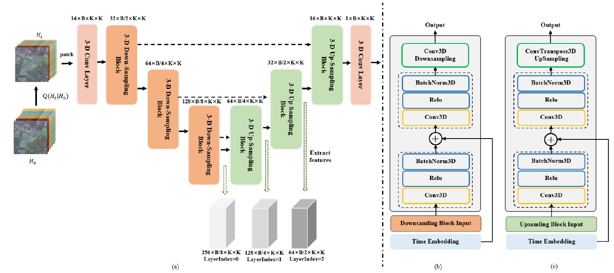

# SpectralDiff: A Generative Framework for Hyperspectral Image Classification with Diffusion Models

[Ning Chen](), [Jun Yue](), [Leyuan Fang](), [Shaobo Xia]()
___________

The code in this toolbox implements the ["SpectralDiff: A Generative Framework for Hyperspectral Image Classification with Diffusion Models"](). 

**The codes for this research includes two parts, [spectral-spatial diffusion module](https://github.com/chenning0115/spectraldiff_diffusion/) and [attention-based classification module](https://github.com/chenning0115/SpectralDiff#spectraldiff). This repository is for the spectral-spatial diffusion module.**

More specifically, it is detailed as follow.



Citation
---------------------

**Please kindly cite the papers if this code is useful and helpful for your research.**

```
N. Chen, J. Yue, L. Fang and S. Xia, "SpectralDiff: A Generative Framework for Hyperspectral Image Classification with Diffusion Models," in IEEE Transactions on Geoscience and Remote Sensing, doi: 10.1109/TGRS.2023.3310023.

```

```
@ARTICLE{10234379,
  author={Chen, Ning and Yue, Jun and Fang, Leyuan and Xia, Shaobo},
  journal={IEEE Transactions on Geoscience and Remote Sensing}, 
  title={SpectralDiff: A Generative Framework for Hyperspectral Image Classification with Diffusion Models}, 
  year={2023},
  volume={},
  number={},
  pages={1-1},
  doi={10.1109/TGRS.2023.3310023}}

```

How to use it?
---------------------
1. Prepare Data, you can get data from [here]().
2. Modify the configuration for the corresponding dataset in train_unet.py file.
    ```
    # for PU
    sign = 'PU'
    batch_size = 20
    patch_size = 64
    select_spectral = []
    spe = 104
    channel = 1 #3d channel

    # for IP
    # sign = 'IP'
    # batch_size = 20
    # patch_size = 64
    # select_spectral = []
    # spe = 200
    # channel = 1 #3d channel

    # for SA
    # sign = 'SA'
    # batch_size = 20
    # patch_size = 64
    # select_spectral = []
    # spe = 104
    # channel = 1 #3d channel
    ```
3. Run the code to train diffusion model, note that the epoch should be more than 30000.
   ```
   python train_unet.py
   ```

4. Modify the Confituration in feature_extract_unet.py file and run the code to extract diffusion features by diffusion model.

    ```
    python feature_extract_unet.py
    ```

Others
----------------------
If you want to run the code in your own data, you can accordingly change the input (e.g., data, labels) and tune the parameters.

If you encounter the bugs while using this code, please do not hesitate to contact us.

Licensing
---------

Copyright (C) 2023 Ning Chen

This program is free software: you can redistribute it and/or modify it under the terms of the GNU General Public License as published by the Free Software Foundation, version 3 of the License.

This program is distributed in the hope that it will be useful, but WITHOUT ANY WARRANTY; without even the implied warranty of MERCHANTABILITY or FITNESS FOR A PARTICULAR PURPOSE. See the GNU General Public License for more details.

You should have received a copy of the GNU General Public License along with this program.
